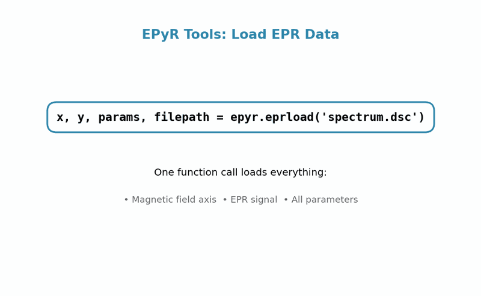
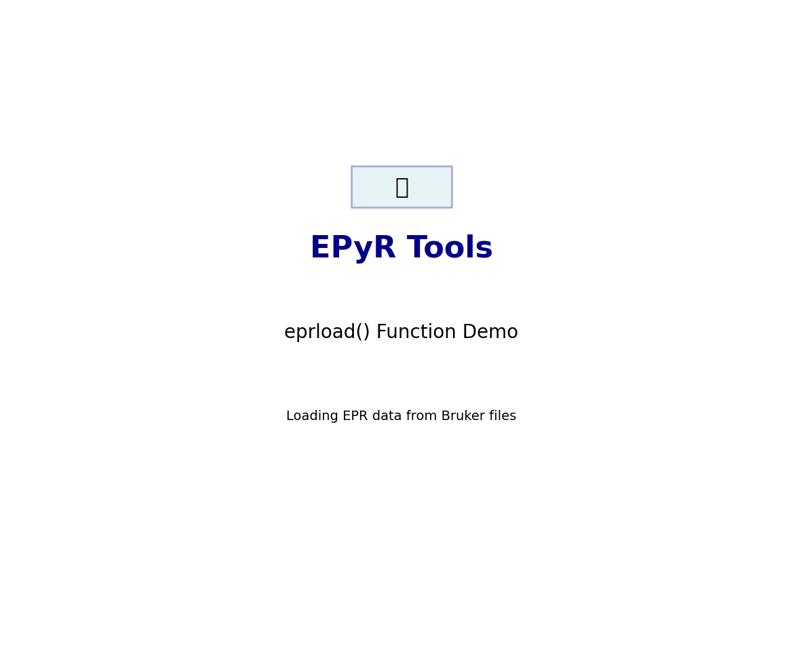

# EPyR Tools Demo GIFs Usage Guide

## Created GIF Files

### 1. `eprload_simple_demo.gif` (69 KB) - **RECOMMENDED**
- **Best for:** GitHub README, social media, quick demos
- **Size:** Optimized for web (800px wide, 69 KB)
- **Duration:** 2.5 seconds per frame
- **Content:** Focused on core eprload() functionality

### 2. `eprload_demo.gif` (166 KB) 
- **Best for:** Presentations, detailed documentation, tutorials
- **Size:** High resolution, more detailed
- **Duration:** 3 seconds per frame  
- **Content:** Comprehensive walkthrough with all features

## Usage in Documentation

### GitHub README.md
```markdown
## Quick Demo: Loading EPR Data



```python
# One line loads everything you need
x, y, params, filepath = epyr.eprload('spectrum.dsc')
```
```

### Documentation Pages
```markdown
## EPyR Tools in Action

### Loading EPR Data with eprload()



The `eprload()` function provides a simple, unified interface for loading EPR data from Bruker files...
```

### Social Media Posts

#### Twitter/X
```
🧲 New EPR Tools release! Load Bruker EPR data with just one line of Python:

x, y, params, filepath = epyr.eprload('spectrum.dsc')

✅ Auto-detects format
✅ Extracts all parameters  
✅ Ready for analysis

#EPR #Python #OpenScience #Spectroscopy

[Attach: eprload_simple_demo.gif]
```

#### LinkedIn
```
Excited to share EPyR Tools - making EPR spectroscopy data analysis more accessible!

Our eprload() function simplifies the entire data loading process:
→ Supports Bruker BES3T and ESP formats
→ Automatic parameter extraction
→ One-line data loading
→ Open source alternative to expensive commercial software

Perfect for researchers working with electron paramagnetic resonance data.

#EPR #ScientificSoftware #Python #OpenSource #Research
```

### Conference Presentations

#### Slide Content
```
Title: "EPyR Tools: Streamlined EPR Data Analysis"

Slide: "Simple Data Loading"
[Insert: eprload_demo.gif]

• One function call loads everything
• Supports all major Bruker formats  
• Automatic parameter extraction
• Built-in visualization options
```

### Website Integration

#### HTML
```html
<div class="demo-section">
    <h3>See EPyR Tools in Action</h3>
    
    <p>Load EPR data with a single function call</p>
</div>
```

### Jupyter Notebook Integration

```python
from IPython.display import Image, display
display(Image('eprload_simple_demo.gif'))
```

## File Specifications

### eprload_simple_demo.gif
- **Dimensions:** 800x480 pixels
- **Format:** Optimized GIF with 256 color palette
- **Frames:** 4 frames, 2.5s each, loops infinitely
- **File size:** 69 KB (web-optimized)

### eprload_demo.gif  
- **Dimensions:** ~1200x800 pixels (variable by frame)
- **Format:** Full-color GIF
- **Frames:** 6 frames, 3s each, loops infinitely  
- **File size:** 166 KB (presentation quality)

## Best Practices

### For Web Use
- Use `eprload_simple_demo.gif` for faster loading
- Consider lazy loading: ``
- Provide fallback static image for accessibility

### For Presentations
- Use `eprload_demo.gif` for detailed explanations
- Consider pausing on key frames for discussion
- Have static backups in case of playback issues

### For Social Media
- `eprload_simple_demo.gif` works best
- Add captions for accessibility
- Include relevant hashtags for discovery

## Static Alternatives

Individual frames are also available as PNG files:
- `eprload_demo_frame_1.png` through `eprload_demo_frame_6.png`
- Use these for static documentation or as GIF fallbacks

## Accessibility Notes

- GIFs auto-play and loop - consider adding pause controls for sensitive users
- Include alt-text describing the demonstration
- Provide static image alternatives where possible

## Updates

When updating the GIFs:
1. Run the Python scripts to regenerate
2. Update this documentation
3. Test in different contexts (README, presentations, social media)
4. Verify file sizes remain web-friendly